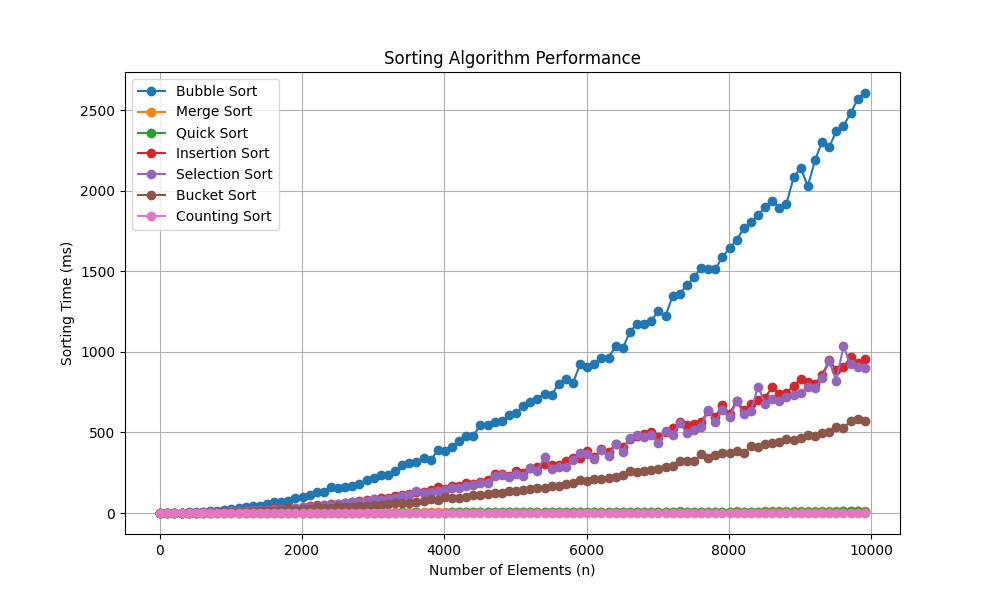

# Major Sorting Algorithms

Here is a list of major sorting algorithms explored here: 

1. **Bubble Sort**
2. **Selection Sort**
3. **Insertion Sort**
4. **Merge Sort**
5. **Quick Sort**
6. **Heap Sort**
7. **Radix Sort**
8. **Bucket Sort**
9. **Shell Sort**
10. **Counting Sort**

The functions within the folder create a sized array with random elements, then are sorted using various sorting algorithms: Should be able to see how well each sorting algorthm **scales**: 
